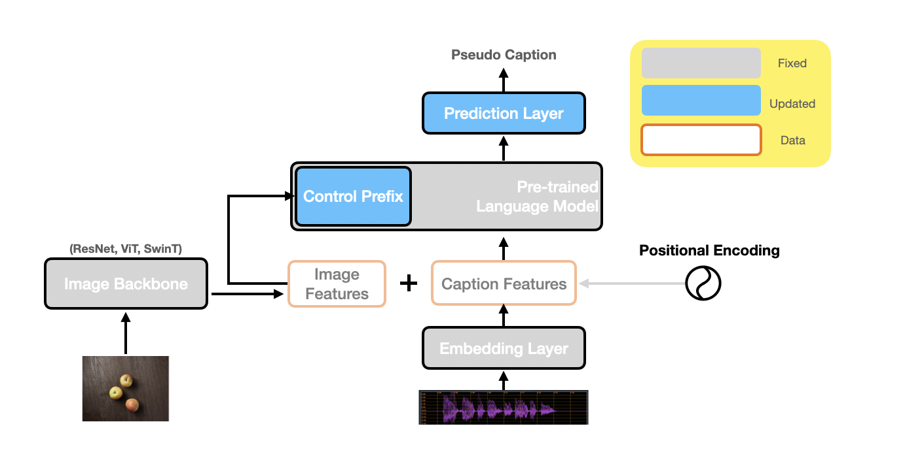

# transformer_I2S

This is an repo to implement an image-to-speech synthesizing model by transformers with some pretrained models. 

This whole image-to-speech synthesizing work is inspired by W.Hsu's IJCNLP paper "[Text-Free Image-To-Speech Synthesis Using Learned Segmental Units](https://wnhsu.github.io/image-to-speech-demo/paper.pdf)", with much updates to improve the system.

## Table of Contents

* [Model Overview](#model-overview)
* [Core Components](#core-components)
* [Environment](#enviroment)
* [Demo/Tutorial](#demotutorial)
* [Usage](#usage)
* [Licence](#licence)

## Model Overview



## Core Components

* **Image Backbone**: We use a ResNet50 based DINO ([paper](https://openaccess.thecvf.com/content/ICCV2021/papers/Caron_Emerging_Properties_in_Self-Supervised_Vision_Transformers_ICCV_2021_paper.pdf), [code](https://github.com/facebookresearch/dino)) for image feature extraction, which is a strong self-supervised model.

* **S2U**: S2U stands for "Speech to Unit", which is a quantification module that transcribe speech into pseudo sequences. Previously we follow D.Harwath's [ICLR paper](https://arxiv.org/pdf/1911.09602.pdf) with so-called ResDAVEnet-VQ3; now we switched to MetaAI's GSLM model ([paper](https://arxiv.org/pdf/2102.01192.pdf), [code](https://github.com/facebookresearch/fairseq/tree/main/examples/textless_nlp/gslm)), which is based on [HuBERT](https://arxiv.org/pdf/2106.07447.pdf) and K-means. Compared with ResDAVEnet-VQ3 (unit-vocab-size: 1024), GSLM models have much smaller unit vocab size (50, 100 or 200).

* **U2S**: U2S stands for "Unit to Speech", which is a Tacotron2 ([paper](https://arxiv.org/pdf/1712.05884.pdf), [code](https://github.com/NVIDIA/tacotron2)) TTS model + HifiGAN ([paper](https://arxiv.org/pdf/2010.05646.pdf),[code](https://github.com/jik876/hifi-gan)) Vocoder, but trained on {unit, speech} pairs instead of {text, speech} pairs.

* **uLM**: uLM stands for "unit Language Model", like the one proposed in GSLM ([paper](https://arxiv.org/pdf/2102.01192.pdf), [code](https://github.com/facebookresearch/fairseq/tree/main/examples/textless_nlp/gslm)). But we didn't use their pretrained model, but to train our own uLM using a 12-layer vanilla transformer ([paper](https://arxiv.org/pdf/1706.03762.pdf), codes in pytorch) using libri-light dataset ([paper](https://arxiv.org/pdf/1912.07875.pdf), [code](https://github.com/facebookresearch/libri-light)). You can found the [model](./saved_model/LM/Libri_Light_small_hubert_256/perplexity_6/perplexity_BEST_checkpoint_coco_1_cap_per_img_1_min_word_freq_gpu.pth.tar) in this repo.

* **I2U**: I2U stands for "Image to Unit", which is a image captioning model. It is a vanilla transformer with customization. You can find all model structure [here](./egs/I2U/models). The current model is innovated by Prefix-tuning ([paper](https://arxiv.org/pdf/2101.00190.pdf), [code](https://github.com/XiangLi1999/PrefixTuning)), which utilized a pretrained LM. In our setting we use image features as prefix to a uLM. You can find customized pytorch transformer based model [here](./egs/I2U/models/models_prompt.py).

## Enviroment

``` bash
conda env create -f encodec_env.yml
```

## Demo/Tutorial

See this ipynb file: [spoken_backbone_tutorial.ipynb](./egs/I2U/spoken_backbone_tutorial.ipynb)

## Usage

* **configuration**: See [config.yml](config.yml). You can specify model params and training params here. Please prepare a json file like [this](transformer_I2S/data/food_dataset_gtts_shuffle.json), and replace the name in the config file.

* **pre-processing**: 
    processed data will be stored at `./data/processed/{data name}`

    ``` bash
    cd ./dataprep/I2U
    python3 create_input_files_food.py
    ```

* **training**:
    processed data will be stored at `./saved_model/I2U/{data name}/{time stamp}`

    ``` bash
    cd ./egs/I2U
    python3 train_i2u_prefix.py
    ```

* **testing**:
    Incremental decoding is implemented for faster inference. See [here](./egs/I2U/models/incremental_decoder.py) for implementation details

    ``` bash
    cd ./egs/I2U
    python3 test_incremental_decode.py
    ```

## Licence:
MIT [LICENCE](LICENCE) (not official yet, TBD)